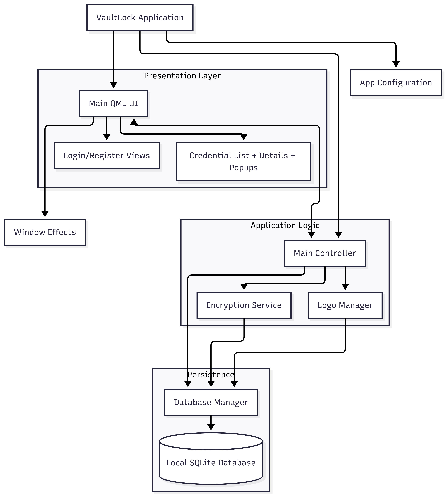

<div align="center">
    <h1>VaultLock</h1>
    <p>Zero-knowledge offline password manager with local encryption, secure vault controls, and a modern desktop admin experience.</p>
</div>

## Problem Statement

Managing sensitive credentials across personal and professional accounts becomes risky when secrets are stored in cloud-tied systems or scattered notes. Users need strong encryption, local control, and fast retrieval without relying on external servers. VaultLock solves this by combining offline-first security, encrypted local storage, and an organized desktop workflow in one app.

## Features

### Authentication & Vault Security

- ● **Master Password Protection:** Vault access is protected by a master password, and plaintext secrets are never persisted directly.
- ● **Strong Key Derivation:** Argon2id-based derivation hardens password-to-key generation against brute-force attacks.
- ● **Encrypted Credential Storage:** Credential entries are encrypted before being written to the local database.
- ● **Clipboard Safety Controls:** Sensitive values copied to clipboard can be auto-cleared to reduce leakage risk.

### Credential Management

- ● **Organized Vault Structure:** Group credentials by folders and manage favorites for faster access.
- ● **Quick Search & Details View:** Find and inspect credentials efficiently through searchable lists and detail panels.
- ● **Credential Creation UX:** Dedicated add/edit flows improve consistency when storing account secrets.
- ● **Logo Enrichment:** Website/domain logos are fetched and cached to make entries easier to recognize visually.

### Desktop Experience & Operations

- ● **Fluent QML Interface:** Desktop UI is built with PyQt6 + QML for smooth, modern interactions.
- ● **Offline-First Operation:** Core functionality works locally without requiring external APIs or hosted services.
- ● **Portable Build Support:** Project can be packaged into an executable for easier distribution.

## Architecture

<p align="center">
    
</p>


1. User logs in with master password.
2. Vault key is derived locally using Argon2id parameters and salt.
3. App decrypts only required data in memory for active operations.
4. Create/update credential operations encrypt data before SQLite writes.
5. UI components render vault state, folders, and details in QML views.

## Tech Stack

**Frontend/UI:** PyQt6, QML (Qt Quick)  
**Backend/App Logic:** Python 3.10+  
**Database:** SQLite  
**Security & Crypto:** cryptography, argon2-cffi  
**Build/Packaging:** PyInstaller

## How It Works

1. On first use, user sets a master password.
2. VaultLock initializes secure local storage and cryptographic configuration.
3. Credentials are encrypted at write time and decrypted on-demand.
4. Folder navigation and search power quick vault discovery.
5. Copy actions and UI safeguards reduce accidental credential exposure.

## Installation / Setup

```bash
git clone https://github.com/Nirjar26/VaultLock---Password-Manager.git
cd VaultLock---Password-Manager
```

```bash
python -m venv .venv
.venv\Scripts\activate
pip install -r requirements.txt
```

```bash
# Run application
python main.py
```

## Folder Structure

```text
.
├── build.py
├── convert_icon.py
├── main.py
├── README.md
├── requirements.txt
├── release/
│   └── config/
└── vaultlock/
    ├── __init__.py
    ├── assets/
    │   └── logos/
    ├── controllers/
    │   └── main_controller.py
    ├── core/
    │   ├── config.py
    │   └── window_effects.py
    ├── database/
    │   ├── __init__.py
    │   └── db_manager.py
    ├── services/
    │   ├── encryption_service.py
    │   └── logo_manager.py
    └── ui/
    ├── AddCredentialForm.qml
    ├── LoginPage.qml
    ├── Main.qml
    └── ...
```

## License

MIT License

## Author / Contact

Nirjar Goswami  
GitHub: https://github.com/Nirjar26
